# ***Deploying  Full Stack Application in kubernetes***

Here we will deploy a react based front end app and flask based backend api in kubernetes(minikube).

##  ***Summary*** 
---

We will build two docker images.One for our react app and another for flask based restapi app. Then we will upload them to docker hub. We need two deployment and service file for deploying our projects on minikube .

code for this project is available [here](https://github.com/FahadAminShovon/kubeTest).

This react app will take a number as input and will send it to the rest api endpoint. This endpoint will reverse the number and make a json response.
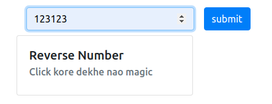

By clicking the submit button in the react app will send a post request.

```js
    state = { 
        num:"",
        reverseNum: ""
     }

    handleChange = (e) =>{
        this.setState({num:e.target.value})
    }

    handleSubmit=()=>{
        axios.post(`/reverser`, this.state)
        .then(res => {
          this.setState({reverseNum:res.data.num})
        })
    }

```

the api endpoint will receive the number , reverse it and send it back to the front end 

*** python code ***

```python
@app.route('/')
def hello_world():
    return 'Hello world'


@app.route('/reverser',methods = ['POST'])
def reverser():
    num = request.get_json().get("num")
    num = int(num[len(num)::-1])
    return jsonify({"num":num})
```

output will look like this

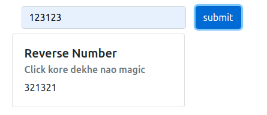

<br>

### ***step 1***
---
***React App***

Create a docker file for react app. Here we are using nginx as web server and reverse proxy.
```Docker 
 
FROM node:11.10.0-alpine AS build-stage

RUN apk add --update --no-cache \
    python \
    make \
    g++

COPY . /src
WORKDIR /src
COPY ./package* ./
RUN npm install
RUN yarn build

FROM nginx:latest
RUN rm -rf /usr/share/nginx/html
RUN mkdir /usr/share/nginx/html
COPY --from=build-stage /src/build/ /usr/share/nginx/html/
COPY default.conf /etc/nginx/conf.d/

EXPOSE 80
```

***Build and Upload image***

Run the command bellow to create an image and give it a tag with your docker hub username and your image name in this format

***yourUserName/projectName:vX***

```bash
docker build -t yourUserName/reverser-front:v1 .
```

upload your image to docker registry .
```bash
docker login -u username -p password
```
```bash
docker push yourUserName/reverser-front:v1 
```

now the image has been uploaded to your docker hub repository

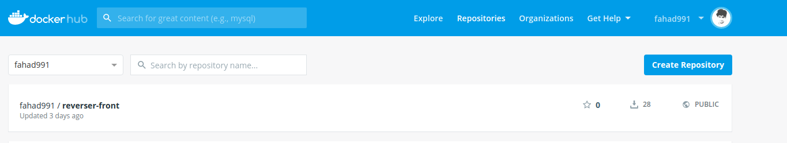

<br>

### ***step 2***
---

***dockerize flask app***

create a docker file for flask app
```Docker 
FROM python:3.7.1

RUN mkdir /app
WORKDIR /app

RUN apt-get update -y 
RUN apt-get install -y python-pip python-dev

# We copy just the requirements.txt first to leverage Docker cache
COPY ./requirements.txt /app/requirements.txt


RUN pip install -r requirements.txt

ADD . /app

EXPOSE 5000


CMD flask run --host=0.0.0.0
```

***build and upload image***
```bash
docker build -t yourUserName/reverser-back:v1 .
```

upload your image to docker hub registry
 ```bash
 docker login -u username -p password
 ```
 ```bash
 docker push yourUserName/reverser-back:v1 
 ```

 now the image has been uploaded to your docker hub repository

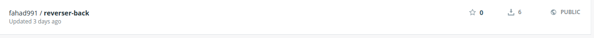

<br>

### step 3
---
***create a deployment files for react app***

configure the code below for your own image.
we will create a yaml file for our front end deployment

```yaml
apiVersion: apps/v1
kind: Deployment 
metadata:
  name: back-end-deployment
spec:
  replicas: 1
  selector:
    matchLabels:
      component: front
  template:
    metadata:
      labels:
        component: front
    spec:
      containers:
        - name: flask-back-end
          image: userName/reverser-front:vX
          ports:
            - containerPort: 80
```

Deployment represents a set of multiple, identical [pods](https://kubernetes.io/docs/concepts/workloads/pods/pod/) . Deployement runs multiple replica of application and replaces or restarts any instances that fail or become unresponsive.


***apiVersion:*** which version of kubernetes api are we using. Different object may requiere different version api Version. apps/v1 is the most common API group. It includes functionality related to running applications on Kubernetes.

***kind***: what kind of object we want to create. Here we are making a deployment object . There are other objects such as Service, Pod, Namespace .

***metadata:*** contains data about the object. here we are giving the name of our object

***spec:*** specifications about the object. 


* ***selector:*** defines how the Deployment finds which Pods to manage. 

* ***mathcLabels:*** which label to match to track the pod which will be created using this template.

* ***template:*** template for the pods we want to create
    * metadata: labels for the pod which will have to match the ***matchLabels*** field of the selector.
    * ***spec:*** specifications of the template.
        * ***conatiners:*** list of containers we want to create inside of our pods.
        each container has following fields.
            * name: name of the container
            * image: image on dockerhub you want to use to create container
            * ports : which port we want to expose inside the cluster node
               * containerPort: which port of the container will be exposed to the Pod.

create a service object to access our app from browser or from other pods .
service defines a policy by which we can access pods.

we will configure the code below to create our own kubernetes sevice object for react front end

```yaml
apiVersion: v1
kind: Service 
metadata:
  name: front-node-port

spec:
  type: NodePort
  ports:
    - port: 80
      targetPort: 80
      nodePort: 31515
      
  selector:
    component: front
```
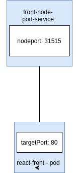

***apiVersion:*** which api version of kubernetes are we using

***kind:*** kind of object we are creating

***metaData:*** data about the object. here we give the name of the object.

***spec:*** specifications about the object.

* ***type:*** what kind of service we are creating. we are creating a nodeport service here. There are other types of services such as clusterIP, loadBalancer, Ingress.

    
* ***port:*** which port will be used to communicate between pods
* ***targetPort:*** In which port traffic will be forwarded from nodeport.
* ***nodePort:*** which port of the pod are we exposing to access outside of the cluster node. We can access the containers from browser using nodeport.

***selector***: selector scans for the pod that matches it's selector. In our case we have ***component: front*** in our service selector and in our template as well . which means this service is for the pods which have label ***component: front***.

<br>

### step 4:
---
apply deployment and service for react front-end.
we are using minikube to deploy our app in local environment.

```bash
kubectl apply -f fornt-deployment.yaml
```
replace front-deployment with your deployment file name.

to see if your deployment object is up . run this command
```bash
kubectl get deployment
```
if your deployment is up , you will see something like this

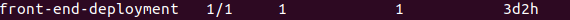

we were creating one replica of our front end app using this deployemtn. If we see the list of pods running in our node we should see a pod of our react front end now

```bash
kubectl get pods
```

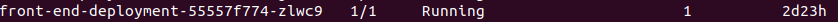

we can see a pod of running react app in our pod list

we can still not access this front end app using browser , because we haven't applied service for this deployment.
to access this pod from outside node we have to apply our nodeport service for this app. 

```bash
kubectl apply -f front-node-port.yaml
```
now let's check our services running on minikube
```bash
kubectl get services
```
we shuld see a running front-end-nodeport service running on our minikube node
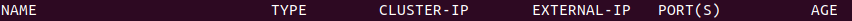
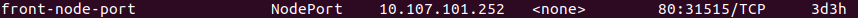

now we can try to access the front end using the node-port we exposed.
We exposed nodeport 31515.
let's try using our localhost:31315
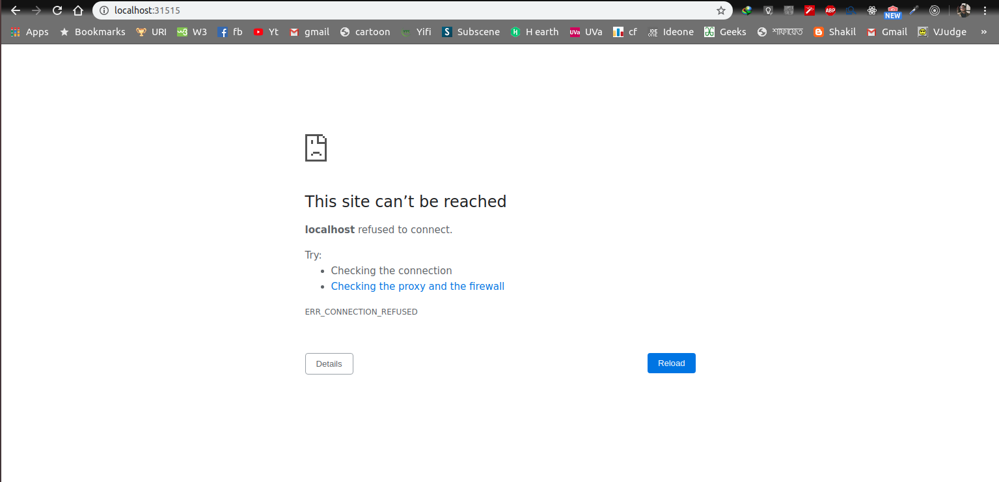
Opps! it says the site can not be reached. 
why? because we are running our app in our minikube cluster not our localhost.
We have to access the app using our minikube ip. minikube has ip assigned to it. we can get the minikube ip using this command

```bash
minikube ip
```
this command will give ip address of minikube.

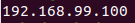

Using this ip and the nodeport we can access our app.
### step 5
---

now write deployment and service file for the backend service and repeat step 3 and 4 for backend app.
### step 5

***back-deploy.yaml***

```yaml
apiVersion: apps/v1
kind: Deployment 
metadata:
  name: back-end-deployment
spec:
  replicas: 1
  selector:
    matchLabels:
      component: back
  template:
    metadata:
      labels:
        component: back
    spec:
      containers:
        - name: flask-back-end
          image: fahad991/reverser-back:v2
          ports:
            - containerPort: 5000
```

***back-node-port.yaml***
```yaml
apiVersion: v1
kind: Service
metadata:
  name: back-node-port
spec:
  type: NodePort
  ports:
    - port: 5000
      targetPort: 5000
      nodePort: 31516
  selector:
    component: back
```

apply these two config file 

```bash 
kubectl apply -f back-deploy.yaml
kubectl apply -f back-node-port.yaml
```
now let's check our deploy list,pod list, service list . we should see something like thise accordingly

***deployment***


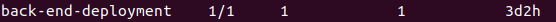

***pod***

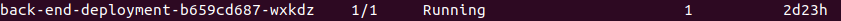

***service***

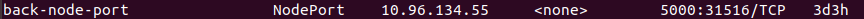

now that our flask app is up and running we can access this app from our browser using minikube ip and nodport ip address .

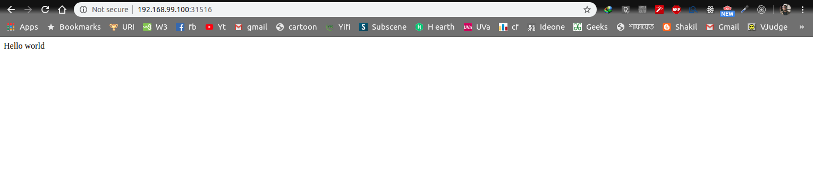

<br>

### step 6:
---
now that both our react front end and flask backend apps are up and running we will establish connection between them.
while we were running our app on our local machine we were using http-proxy middleware to bypass our http requests to our backend app from frontend app.

this is snap of our setupProxy.js file

```js
const { createProxyMiddleware } = require('http-proxy-middleware');

module.exports = app => {
  app.use(
    "/reverser",
    createProxyMiddleware({
      target: "http://localhost:5000",
      changeOrigin: true
    })
  );

  app.use(
    "/summation",
    createProxyMiddleware({
      target: "http://localhost:5000",
      changeOrigin: true
    })
  );
}
```

but, http-proxy-middleware only works on local machine. Now that we are working on minikube cluster we have to find some other way to send request from our front end to our backend service.
for this purpose we'll write a nginx config file

***default.conf***

```nginx
server {
    listen 80 ;

    location / {
        root   /usr/share/nginx/html;
        index  index.html index.htm;
	    try_files $uri $uri/ /index.html;
    }


    location /reverser {
                proxy_pass http://192.168.99.100:31516;
    }


    error_page   500 502 503 504  /50x.html;
    location = /50x.html {
        root   /usr/share/nginx/html;
    }


}
```

nginx works as both server and reverse proxy.


```nginx
    location / {
        root   /usr/share/nginx/html;
        index  index.html index.htm;
	    try_files $uri $uri/ /index.html;
    }
```
this part above in the config file works as a file server . 

```nginx
    location /reverser {
                proxy_pass http://192.168.99.100:31516;
    }
```
this part above in the config file works as a reverse proxy . everytime we send a request to ***reverser*** it redirects the request to  ***http://192.168.99.100:31516***

look carefully at the proxy_pass . the part consists of three parts
* http (protocol)
* 192.168.99.100 ( $minikube ip)
* 31516 ( the nodeport where we exposed our flask app)


now that our nginx configuration file is all set the fontend app is able to send request to python backend service and successfully get the result.
